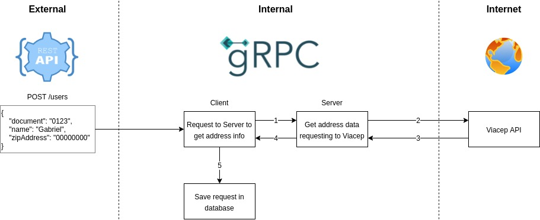

<h1 align="center">poc-grpc-python-api-rest-consumer</h1>

A simple API Rest to insert a user in database and consume a gRPC Server to get data from the zipCode.

**POST /v1/users**

Request Body
``` json
{
    "document": "00011122233",
    "name": "Gabriel",
    "zipCode": "01234560",
    "number": "01"
}
```

Response - 201
``` json
{
    "message": "User successfully saved",
    "document": "00011122233",
    "name": "Gabriel",
    "cep": "01234560",
    "city": "City Name",
    "neighborhood": "Neighborhood Name",
    "street": "Street Name",
    "number": "01"
}
```

<h2 align="center">Flow</h2>
1. The API receives a request and requests to the gRPC Server with the zipCode to get data of the address.
2. The Server requests to Viacep API and returns to the client.
3. The client receives the response and saves the item in database and returns the response to the client.


